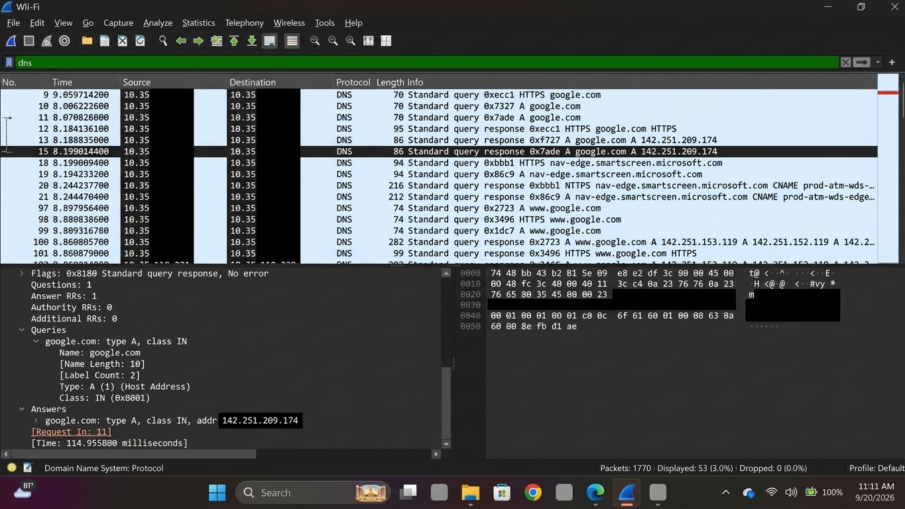
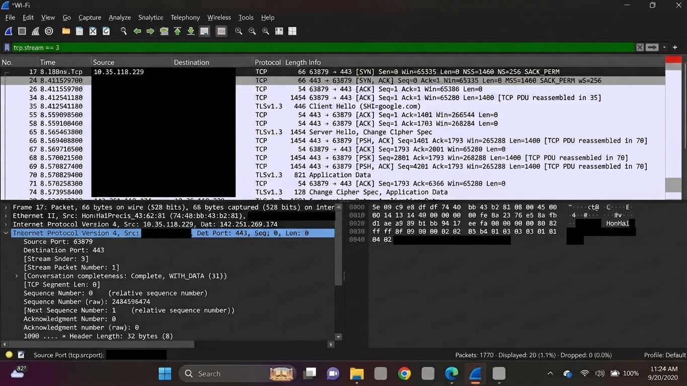

# Follow a Web Connection with Wireshark

## Project Overview

This project demonstrates how Wireshark can be used to follow a web connection from DNS resolution through the TCP connection and TLS 1.3 handshake.

## Objective

To capture and analyze normal web browsing traffic and identify:

* The DNS request and response
* The destination IP address
* The TCP connection
* The TLS 1.3 handshake
* The Wireshark display filters used during the analysis

## Environment

* Operating System: Windows
* Network: Wi-Fi via mobile hotspot
* Tool: Wireshark
* Web Browser: Google Chrome
* Command-Line Tool: Windows Command Prompt
* Website accessed: `www.google.com`

## Methodology

1. Connected the Windows PC to the internet using a mobile hotspot.
2. Opened Wireshark and selected the Wi-Fi network interface.
3. Started packet capture.
4. Opened `www.google.com` in Google Chrome to generate normal web traffic.
5. Opened Windows Command Prompt and performed a DNS lookup using:

```text id="6d9m3a"
nslookup www.google.com
```

6. Captured the DNS request and response in Wireshark.
7. Used Wireshark display filters to identify the relevant web traffic.
8. Isolated TCP stream `3` to follow the specific TCP connection.
9. Examined the TCP three-way handshake and TLS 1.3 handshake.
10. Stopped the capture and saved the relevant evidence for documentation.

## 1. DNS Request and Response

I captured the DNS request and response generated when accessing `www.google.com`.

The DNS response returned multiple IPv4 addresses, including:

`142.251.209.174`

This address was subsequently observed as the destination IP in the TCP web connection.

### Screenshot



## 2. Filtered Web Connection

I used the following display filter to isolate the TCP connection:

```text id="lhxv9s"
tcp.stream == 3
```

The filtered stream showed the TCP three-way handshake followed by the TLS 1.3 handshake:

```text id="3pyr2f"
SYN
SYN, ACK
ACK
Client Hello
Server Hello
```

### Connection Details

| Field            | Value             |
| ---------------- | ----------------- |
| Source IP        | `10.35.118.x`   |
| Destination IP   | `142.251.209.174` |
| Source Port      | `63879`           |
| Destination Port | `443`             |
| TCP Stream       | `3`               |
| TLS Version      | `TLS 1.3`         |

### Screenshot



## 3. Display Filters Used

The following Wireshark display filters were used during the analysis:

```text id="2d9r7q"
dns
```

```text id="m0t8r1"
tcp.port == 443
```

```text id="q4s2zk"
tcp.stream == 3
```

## 4. What Happened Between the DNS Lookup and Connection

The browser first performed a DNS lookup for `www.google.com`. The DNS response returned several IPv4 addresses, including `142.251.209.174`.

The computer then established a TCP connection from `10.35.118.x` using source port `63879` to `142.251.209.174` on destination port `443`.

The TCP three-way handshake was completed using SYN, SYN-ACK, and ACK packets. After the TCP connection was established, the browser initiated a TLS 1.3 handshake using Client Hello and Server Hello messages.

This established the secure HTTPS communication channel for encrypted web traffic.

## 5. Traffic Flow

```text id="0v7m3p"
www.google.com
      |
      | DNS Request
      v
DNS Response
      |
      | 142.251.209.174
      v
TCP Connection
10.35.118.x:63879
        |
        v
142.251.209.174:443
        |
        v
SYN → SYN-ACK → ACK
        |
        v
TLS 1.3
Client Hello → Server Hello
        |
        v
Encrypted HTTPS Communication
```

## 6. Key Findings

* DNS was used to resolve `www.google.com` to IPv4 addresses.
* `142.251.209.174` was observed in both the DNS response and the subsequent TCP connection.
* The web connection used TCP port `443`.
* The TCP three-way handshake was successfully observed.
* The connection proceeded to a TLS 1.3 handshake.
* Wireshark display filters were used to isolate and analyze the relevant traffic.

## 7. Skills Demonstrated

* Packet capture and analysis
* DNS traffic analysis
* TCP/IP analysis
* TCP three-way handshake identification
* TLS 1.3 traffic identification
* Wireshark display filters
* Network traffic investigation
* Basic HTTPS connection analysis
* Command-line DNS troubleshooting

## Screenshots

The project includes screenshots showing:

1. DNS request and response
2. Filtered TCP/TLS web connection

> Note: The raw `.pcapng` capture file is not included in the public repository to avoid exposing potentially sensitive network information.
